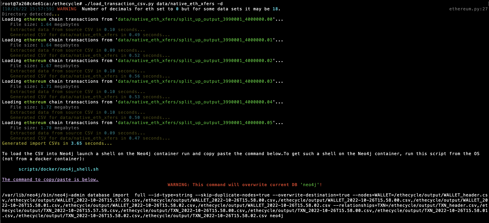

# Transaction Graph DB
* Wallet addresses are vertices AKA nodes. All vertices currently use the label `wallet` so the `.hasLabel()` predicates seen in many tutorials are irrelevant and do not need to be used.
* Transactions are edges and contain properties like `value`, `block_number`, etc. All edges use the label `transaction` so the same rule applies. Theoretically we could distinguish `ETH` txions from `ERC20` txions from gas fees from swaps etc. down the road but for now they're just `transaction`.
* Look in [Graph](ethecycle/graph.py) for examples of queries that actually work.

### Prerequisites
This is known to work with these versions of `docker` and `docker-compose`.

```
$ docker-compose --version
Docker Compose version v2.10.2

$ docker --version
Docker version 20.10.17, build 100c701
```

# Usage
To launch docker containers and load graph data:

```bash
# Clone repo and cd into the repo directory
git clone https://github.com/michelcrypt4d4mus/ethecycle.git
cd ethecycle

# Generate ssh key pair your containers can use to talk to each other and create some .env files:
scripts/docker/container_file_setup.sh

# Edit local copy of .env to set TXION_DATA_DIR as the location of some txion CSVs
# NOTE: After the first build you may want to set REBUILD_CHAIN_ADDRESS_DB to avoid rebuilding
#       the chain addresses DB every time.
vi .env

# When you run this command docker-compose should build everything and leave you in a
# bash shell, at which point you can run 'bpython' to get a python REPL etc.
scripts/docker/python_etl/shell.sh

# Run script to get updated JVM settings for neo4j once you have allocated docker memory:
scripts/docker/neo4j/generate_.neo4j.env_file.sh  # Add -h for help
```

## Loading Data
Once you are in the container shell the `./load_transactions.py` script will prep CSVs for Neo4j's bulk loader and then load them (unless you specify `--extract-only`). This approach uses the `neo4j-admin database import` tooling ([documentation](https://neo4j.com/docs/operations-manual/current/tools/neo4j-admin/neo4j-admin-import/)) which is theoretically significantly faster than `LOAD CSV` at getting data from the disk and into Neo4j.

`load_transactions.py` takes a directory of CSVS or a single CSV, processes them to add some columns (e.g. `token_symbol` and `blockchain`), does decimal conversion where it can, etc., and writes 2 output CSVs for each input CSV (wallets, txns) `output/` directory along with two one line CSVs (one each for the wallet and transaction headers).

How to run it:
```bash
# Show help:
./load_transactions.py --help

# First time you must run with --drop to overwrite the database called 'neo4j' (community edition limitation):
./load_transactions.py /path/to/transactions.csv --drop

# You can also run it against an entire directory of CSVs:
./load_transactions.py /path/to/transactions/ --drop

# Load only USDT txions:
./load_transactions.py /path/to/transactions.csv --token USDT --drop

# Perform the extraction and transformation but display load command on screen rather than actually execute it:
./load_transactions.py /path/to/transactions.csv --drop --extract-only
```

Example output:



### Running From Outside Of Docker Container
Cannot guarantee these steps work but they probably will work.

1. Create a virtual env in the project dir: `python -m venv .venv`
1. Activate the venv: `. .venv/bin/activate`

## Queries
Some queries can be found in the [`queries/`](queries/) folder.

#### Index Creation Queries
Some reasonable guesses as to useful ways to index transactions can be found [here](queries/indexes.cql).

## Other Useful Commands
* Get shell on the Python ETL container: `scripts/docker/python_etl/shell.sh`
* Get shell on the test env Python ETL container: `scripts/docker/python_etl/test_shell.sh`
* Get shell on the Neo4j container: `scripts/docker/neo4j/shell.sh`
* Generate `.env.neo4j` file ([example](.env.neo4j.example)): `scripts/docker/neo4j/generate_.neo4j.env_file.sh -h`
* Display the wallet tags: `scripts/show_wallet_labels.sh`
* Rebuild chain address database: `scripts/chain_addresses/reimport_all.sh`
* Print a query that can be run on Dune to find new wallet tags: `scripts/dune_update_query.sh`
* Set the environment variable `DEBUG=true` when running commands to see various debug ouutput


# Neo4j
**IMPORTANT:** The community edition only allows you to have one database per server and it must be called `neo4j`.

After starting you can browse to [http://localhost:7474/browser/](http://localhost:7474/browser/) to run queries. Alternatively (and more 'performantly') Neo4j makes a [desktop application](https://neo4j.com/download/).

## Running Queries
* Addresses start with `0x` (same as etherscan)
* All addresses in the DB are lowercased, so make sure to use `toLower()` on an address of mixed/upper case.
* Occasionally Neo4j from docker messes up the permissions. If that happens it may help to get on the container and run
  ```bash
  cd /var/lib/neo4j/data
  sudo chown -R neo4j:neo4j databases/
  sudo chown -R neo4j:neo4j transactions/
  ```


## Other Neo4J Resources
* [Official Cypher Introduction](https://neo4j.com/docs/getting-started/current/cypher-intro/). Cypher is Neo4j's custom query language.
* [Cypher query style guide](https://s3.amazonaws.com/artifacts.opencypher.org/M20/docs/style-guide.pdf)
* [Neo4j 5.1.0 on dockerhub](https://hub.docker.com/layers/library/neo4j/5.1.0-community/images/sha256-09fe15433bc437a85d07f4b6e832ce2e751117725f5394eb8df5fe642707133f?context=explore)
* [Official Neo4j on Docker operations manual](https://neo4j.com/docs/operations-manual/current/docker/) (There's also an overview of Neo4j on Docker [here](https://neo4j.com/developer/docker-run-neo4j/) as well as a [list of configuration options settable by env vars](https://neo4j.com/docs/operations-manual/current/docker/ref-settings/))
* [Neo4j Desktop app](https://neo4j.com/developer/neo4j-desktop/)
* [Curated list of apps and plugins for Neo4j](https://install.graphapp.io)
* [Neo4J operations manual](https://neo4j.com/docs/operations-manual/current/)
* [Neo4j admin tools/config](https://neo4j.com/docs/operations-manual/current/tools/neo4j-admin/)
* [Article on supernodes and Neo4j](https://medium.com/neo4j/graph-modeling-all-about-super-nodes-d6ad7e11015b)

#### ETL Related Resources
* [Bulk load data into Neo4j](https://neo4j.com/docs/operations-manual/current/tools/neo4j-admin/neo4j-admin-import/)
* [CSV header format docs](https://neo4j.com/docs/operations-manual/current/tools/neo4j-admin/neo4j-admin-import/#import-tool-header-format)
* [Neo4j ETL Tool](https://neo4j.com/developer/neo4j-etl/) Claims to be able to connect to an RDBMS and port data quickly.
* [Neo4j LOAD CSV example](https://neo4j.com/blog/neo4j-call-detail-records-analytics/) that creates nodes from a single relatonships file.
* [5 Tricks for Batch Updates](https://medium.com/neo4j/5-tips-tricks-for-fast-batched-updates-of-graph-structures-with-neo4j-and-cypher-73c7f693c8cc)


# Questions
1. IIRC you said the txion amounts were already correctly adjusted for decimals?  (AKA divided by `10^18` for most tokens)
1. Current unique ID for edge is `transaction_id = f"{self.transaction_hash}-{self.log_index}"`. Does that make sense?
1. Do you have a rough estimate as far as blocks per hour and/or blocks per day?


# Potential Queries / TODO
1. Identify the largest short term pass through wallets (AKA wallets with large xfers in and out in a short time frame that end up w/0 balances and are not used again)
1. More address sources:
   1. https://github.com/CryptoScamDB/blacklist/blob/master/data/urls.yaml
   1. [Stolen OpenSea NFTs](https://dune.com/beetle/opensea-stolen-assets-top-pfp-collections)
   1. [Ethereum Name Service](https://docs.ens.domains/dapp-developer-guide/resolving-names)


# Other Technologies
* [ArangoDB](https://www.arangodb.com/) - Second most commonly recommended after Neo4j.
* [Apache AGE](https://age.apache.org) - Postgres extension. No Tinkerpop support, only OpenCypher.
* [ArcadeDB](https://arcadedb.com) - New fork of OrientDB. Gremlin and OpenCypher support.
* [MemGraph](https://memgraph.com) - In memory graph DB.
* TigerGraph comes up sometimes

